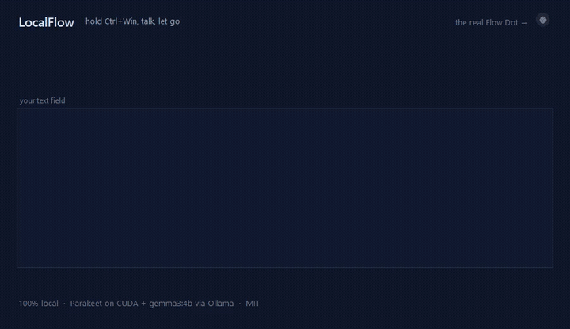
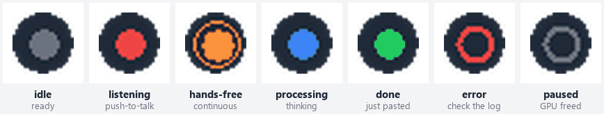

<div align="center">

# LocalFlow

**Hold a key. Talk. Let go. Your words appear — cleaned up — in whatever you're typing into.**

A free, private, GPU-accelerated voice dictation app for Windows.
Everything runs on your own machine. No account, no subscription, no cloud, no word limits.

[](https://github.com/DatafyingTech/LocalFlow/actions/workflows/tests.yml)
[](LICENSE)
[](https://www.python.org/downloads/)
[](#requirements)

</div>

---

## What it does



*Nothing here is staged. A real person speaking into a real microphone, transcribed by Parakeet on
the GPU, cleaned up by a local gemma3:4b, and typed into the text field by the real injection code.
The millisecond figures on screen are the actual measured times from that take. Reproduce it with
`python -m tools.record_demo`.*

You hold **Ctrl+Win**, say *"send a report to Mark, no no wait, I meant to say send it to Sarah and
CC me"*, and let go. Under half a second later, this lands in your email, chat box, or code editor:

> Send a report to Sarah and CC me.

That is the second scene in the recording above, and it took 394 ms end to end.

The filler words are gone. The punctuation and capitals are there. It understood that you corrected
yourself and kept only what you meant. It never left your computer.

It works in **any** app that accepts typed text — browser, Slack, Word, VS Code, even fullscreen games.

### Why not just use a cloud dictation app?

Commercial dictation apps like Wispr Flow are excellent, and this project is openly inspired by one.
But they send your microphone audio to someone else's servers, cost around $12–15/month, and cap
what you can dictate. LocalFlow is a like-for-like replacement that runs entirely on your GPU.

|  | LocalFlow | Typical cloud dictation app |
|---|---|---|
| **Cost** | Free forever | ~$12–15/month |
| **Word limit** | None | Often ~2,000 words/week on free tiers |
| **Your audio** | Never leaves the machine | Uploaded to a vendor's servers |
| **Works offline** | Yes, completely | No |
| **Speed** | ~0.25–0.5 s (your GPU) | ~1–2 s (network round trip) |
| **In fullscreen games** | Yes, types like a real keyboard | Usually not |
| **Setup** | One script, 10-30 minutes | Download and sign in |
| **Needs** | An NVIDIA GPU for full speed | Nothing but internet |

---

## Highlights

- **Push-to-talk or hands-free.** Hold the key, or double-tap it to keep dictating continuously
  while text flows in at every natural pause.
- **Fixes what you say as you say it.** Say *"no wait"*, *"scratch that"*, *"I meant"*, or *"oops"*
  and the correction is applied instead of transcribed.
- **Understands lists.** *"For the store I need potatoes, cream cheese, lasagna and spaghetti"*
  comes out as a lead-in line with a proper bullet list under it.
- **Whisper-quiet input works.** Every clip is volume-normalized before transcription, so you can
  dictate at a near-silent murmur in a shared room.
- **Types into fullscreen games.** Games ignore normal paste; LocalFlow switches to real keystrokes.
  It never presses Enter for you unless you literally say *"press enter"*.
- **Stays out of your GPU's way.** Caps its own video memory, unloads the language model when idle,
  and has a one-click **Pause (free GPU)** for gaming sessions.
- **A dot, not a window.** A 22-pixel status dot you can drag anywhere. It never steals focus from
  whatever you're typing into.
- **Your words stay yours.** A local history file you own, and nothing else. No telemetry at all.

---

## Requirements

|  | Minimum | Recommended |
|---|---|---|
| **OS** | Windows 10 64-bit, version 1809 | Windows 11 |
| **CPU** | Any 64-bit x86 CPU | 6 cores or more |
| **RAM** | 8 GB | 16 GB |
| **GPU** | None. It runs on CPU, slowly | NVIDIA with **6 GB VRAM**, driver 525+ |
| **Disk** | 10 GB free, split across two drives | SSD |
| **Python** | 3.11 | 3.12 |
| **Internet** | Only to install | Not needed afterwards |

**How much VRAM you actually need.** Speech recognition takes about 3 GB and is capped there by
`asr.gpu_mem_limit_mb`. The optional cleanup model adds about 3 GB more.

| Your GPU | What to expect |
|---|---|
| **8 GB or more** | Everything on, nothing to think about. A GTX 1660, RTX 2060, 3060, 4060 or better. |
| **6 GB** | Works well. Leave headroom by keeping the cleanup model unloaded when idle, which is already the default. |
| **4 GB** | Speech recognition is fine. Use a smaller cleanup model (`ollama pull gemma3:1b`, then set `llm.model: gemma3:1b`) or set `cleanup.level: none`. |
| **No NVIDIA GPU** | Run `install.bat -CPU`. Expect a few seconds per utterance instead of a fraction of a second. |

**Where the 10 GB goes.** About 5.3 GB sits next to LocalFlow: 2.4 GB for the speech model and
2.9 GB for the Python environment. About 3.3 GB more goes to `%USERPROFILE%\.ollama` for the
cleanup model, which is usually on your C: drive. The installer checks both and tells you which one
is short.

You do **not** need the CUDA toolkit or Visual Studio. The installer pulls everything through pip.
Do not install PyTorch into this environment; it brings an incompatible cuDNN.

**What is optional.** [Ollama](https://ollama.com) powers the smart cleanup that removes filler
words, applies your self-corrections and formats lists. Without it, LocalFlow still transcribes and
still applies its built-in rules, just less cleverly. AMD and Intel GPUs are not accelerated yet.

**A microphone**, obviously. Anything works, including a laptop's built-in one. Audio is normalized
before transcription, so a cheap mic and a quiet voice are both fine.

### Linux and macOS

**Not supported today, and it is not a small job.** Roughly two thirds of the code is portable:
speech recognition, audio capture, the cleanup rules, the Ollama pass, config and history have no
Windows dependency at all. The parts that do not port are the ones that make it feel instant:

| Piece | Portable? |
|---|---|
| Parakeet / Whisper recognition, audio capture, cleanup, Ollama, config, history | Yes, as-is |
| Global hotkey | Mostly. `pynput` works on X11 and macOS, but Wayland blocks global key grabs |
| Typing into the focused window | No. Rewrites needed for X11 (XTest), Wayland (portals, heavily restricted) or macOS (CGEvent, needs Accessibility permission) |
| Focus and fullscreen detection | No. Win32-only today |
| The status dot staying unfocused | No. Relies on a Win32 window style |

Wayland is the real obstacle: it deliberately prevents applications from reading global keys or
injecting synthetic input into other windows, which is the entire mechanism LocalFlow depends on.
A Linux port is realistic on X11 and macOS, and awkward on Wayland. Contributions welcome, see
[CONTRIBUTING.md](CONTRIBUTING.md).

---

## Install

**1. Install the two prerequisites** (skip either if you already have it):

- [Python 3.12](https://www.python.org/downloads/) — tick **"Add python.exe to PATH"** in the installer.
- [Ollama](https://ollama.com/download) — optional, but it makes the cleanup much better.

**2. Download LocalFlow** — [grab the ZIP](https://github.com/DatafyingTech/LocalFlow/archive/refs/heads/main.zip)
and extract it anywhere, or:

```powershell
git clone https://github.com/DatafyingTech/LocalFlow.git
cd LocalFlow
```

**3. Double-click `install.bat`** and wait.

It checks your system, creates an isolated Python environment, writes your `config.yaml`,
downloads the speech model (~2.5 GB, one time), pulls the cleanup model, and runs a self-test.
That is about **8 GB of downloads** and **10 to 30 minutes** on a normal connection. It tells you
plainly if something is missing and what to do about it.

That 10 GB is not all in one place. About 5.3 GB goes next to LocalFlow (`.venv` plus `models`) and
about 3.3 GB goes to `%USERPROFILE%\.ollama`, which is usually on C:. The installer checks both drives
and names the one that is short.

**4. Double-click `run.bat`.**

A grey dot appears near the bottom of your screen and a tray icon appears by the clock. When the dot
is grey, you're ready.

> **Want it always available?** Press `Win+R`, type `shell:startup`, and drop a shortcut to
> `run.bat` in the folder that opens.

### Three things Windows will do that are not bugs

**1. "Windows protected your PC" when you double-click a `.bat`.**
Windows SmartScreen shows a blue box for any script that came from the internet. Click
**More info**, then **Run anyway**. You can avoid it entirely: before you extract the ZIP,
right-click it, choose **Properties**, tick **Unblock** at the bottom, click OK, and then extract.
Windows marks everything inside as trusted and stops asking.

**2. Recording produces nothing at all.**
Check **Settings > Privacy & security > Microphone** and make sure **"Let desktop apps access your
microphone"** is switched on. When it is off Windows does not show an error or a prompt. The
microphone simply returns silence, forever, and LocalFlow looks broken. `--doctor` opens the
microphone and tells you if this is what is happening.

**3. Your antivirus flags LocalFlow.**
LocalFlow watches for a global hotkey and sends synthetic keystrokes, because that is the only way
to hear Ctrl+Win while you are typing in another app and then put text into it. Those two
behaviours are also what a keylogger does, so some antivirus heuristics score them. It is a
heuristic, not a detection of anything LocalFlow actually does: the source is right here, the
keystroke listener never writes keys anywhere, and nothing is sent off the machine. If your AV
quarantines it, add the LocalFlow folder as an exclusion, or read
[`localflow/hotkeys.py`](localflow/hotkeys.py) and
[`localflow/inject.py`](localflow/inject.py) first and decide for yourself.

---

## Using it

Open any text box. Notepad, a browser address bar, Slack, your email. Hold **Ctrl+Win** and talk.

| What you want | How |
|---|---|
| **Dictate one thing** | Hold **Ctrl+Win**, talk, release |
| **Keep dictating** | **Double-tap Ctrl+Win**, press **Ctrl+Win+Space**, or click the dot. Text arrives at each pause |
| **Stop dictating** | Tap **Ctrl+Win** again, click the dot, or press **Esc** |
| **Throw away what you just said** | **Esc** while still holding |
| **Paste that again** | **Shift+Alt+Z** |
| **Extra-polished version** | Hold **Ctrl+Win+Alt** instead (slower, rewrites for clarity) |
| **Free up the GPU for a game** | Right-click the dot → **Pause (free GPU)** |
| **Change anything** | Right-click the dot or the tray icon |

### Things you can just say

| Say this | Get this |
|---|---|
| "period", "comma", "question mark" | `.` `,` `?` |
| "new line", "new paragraph" | A line break, or a blank line |
| "no wait", "scratch that", "I meant", "oops" | The thing you said before it is replaced |
| "press enter" | Your text is sent (the only time Enter is ever pressed) |
| Three or more items in a row | A bulleted list |

### What the dot is telling you



| Dot | Meaning |
|---|---|
| Grey | Ready and listening for your hotkey |
| Red, pulsing with your voice | Recording |
| Orange/red with a ring | Hands-free mode is on |
| Blue, blinking | Thinking — your text is coming |
| Green | Just pasted |
| Red ring | Something went wrong (check `localflow.log`) |
| Hollow grey ring | Paused, GPU freed |

Drag the dot anywhere you like; it remembers. Right-click it for the full menu.

---

## Making it yours

Everything lives in `config.yaml`, next to the app. The installer creates it for you, and
LocalFlow creates it on first run if it is missing. Either way it starts as a copy of
`config.example.yaml`, so nothing you see there is a surprise.
[`config.example.yaml`](config.example.yaml) documents every option. The settings people change most:

```yaml
hotkeys:
  ptt: [ctrl, win]        # Conflicts with something? Try [ctrl, alt] or a single key like [f9]

cleanup:
  level: medium           # none = fastest, raw-ish | light | medium | high = most rewriting
  dictionary:             # Names it keeps getting wrong
    local flow: LocalFlow
  snippets:               # Say the phrase, get the text
    "my signature": "Best regards,\nYour Name"

audio:
  device: ""              # Part of your mic's name, or "" for the system default
```

A single key such as `[f9]` works fine as the push-to-talk chord. Bear in mind LocalFlow never
swallows the key, so whatever you pick still reaches the app you are typing into. Function keys and
modifier chords are the safe picks; a letter key is not.

**Cleanup levels.** `none` is pure transcription and the lowest latency. `light` removes fillers and
fixes punctuation. `medium` (the default) also fixes grammar and formats lists. `high` rewrites for
clarity and brevity — good for turning rambling into a tidy paragraph.

---

## Privacy and your data

Nothing you say or type is transmitted anywhere. There is no account, no telemetry, no crash
reporting, no update check, and no analytics of any kind. LocalFlow opens no listening socket.

Everything it writes lives in the LocalFlow folder, and that is the complete list:

| File | What is in it |
|---|---|
| `config.yaml` | Your settings. Also your dictionary and snippets, so treat it as yours. |
| `history.jsonl` | **The plain text of every utterance you dictate**, one JSON line each, capped at `history.max_entries` (5000 by default). Each line also records the **window title** of the app you dictated into, which can name a document or a browser tab. |
| `localflow.log` | Timings, errors, state changes, and the name of the foreground program. With `debug: true` it also logs window titles and the full pasted text. |
| `models/` | The downloaded speech model. No personal data. |

`history.jsonl` is the one to know about. It is readable plain text on your disk, so anyone who
can read your files can read what you dictated. That is a deliberate trade for being able to
re-paste and search your own words. You can delete it at any time (LocalFlow just starts a new
one), or turn it off completely:

```yaml
history:
  enabled: false
```

**The only time LocalFlow uses the network is during install**: pip fetches the Python packages,
Hugging Face serves the speech model once, and Ollama pulls the cleanup model. After that the app
sets `HF_HUB_OFFLINE=1` on itself and the only connection it ever makes is to `127.0.0.1:11434`,
which is Ollama on your own machine. Unplug the network and everything still works.

---

## Updating

Installed with git:

```powershell
git pull
.\install.bat
```

`install.bat` is idempotent. It reuses the `.venv` and the downloaded model, installs anything new,
and leaves your `config.yaml` alone.

Installed from the ZIP: download the new ZIP, unblock it, and extract it over your LocalFlow
folder. Keep your existing `config.yaml` when it asks (the update ships `config.example.yaml`, not
`config.yaml`, so it should not offer to overwrite it). Then run `install.bat` again.

New settings added by an update are filled in from the built-in defaults, so an old `config.yaml`
never stops working.

## Uninstall

LocalFlow does not install anything into Windows, so there is nothing in Add/Remove Programs.

1. **Delete the LocalFlow folder.** That takes `.venv`, `models`, your config, your history and the
   log with it. Nothing is left behind.
2. **Remove the cleanup model** if you do not use Ollama for anything else:
   `ollama rm gemma3:4b`. To remove Ollama itself, uninstall it from Windows Settings.
3. **Remove the startup shortcut** if you made one: press `Win+R`, type `shell:startup`, and delete
   the `run.bat` shortcut in the folder that opens.

Python stays installed; uninstall it from Windows Settings if you only added it for LocalFlow.

---

## Games and anti-cheat

Games read the keyboard directly and ignore a normal paste, so when a fullscreen game is in front,
LocalFlow types your text **key by key using hardware scan codes** — the same mechanism used by
macro keyboards, AutoHotkey, Steam Input, and accessibility software.

**LocalFlow never touches the game process.** No DLL injection, no hooks in other programs, no
reading game memory, no graphics overlay hooking, no driver, and no messages posted into the game's
window. It only asks Windows which window is in front, then sends keystrokes to whatever has focus.
Keystroke timing is slightly randomized so it doesn't look like a periodic macro, typing is capped
at 500 characters, and **Enter is never pressed unless you say "press enter"**.

That said: this is a tool for typing chat messages, not for automating gameplay. No third-party tool
can promise how a given anti-cheat will behave, and strict kernel-level systems may simply ignore
synthetic input. Use it for chat, and if a game's rules forbid any synthetic input, don't use it there.

---

## When something goes wrong

**Start here.** Run this and read what it tells you — it checks every part of the stack:

```powershell
.\.venv\Scripts\python.exe -m localflow --doctor
```

<details>
<summary><b>The hotkey does nothing</b></summary>

Another app may already own Ctrl+Win (PowerToys is a common culprit) — change `hotkeys.ptt` in
`config.yaml`. Windows also blocks normal apps from seeing keys while an **administrator** window is
focused; if you dictate into admin apps, run LocalFlow as administrator too.
</details>

<details>
<summary><b>It says it can't use my GPU / fell back to CPU</b></summary>

Update your NVIDIA driver (525 or newer). Then check that the CPU-only ONNX package isn't shadowing
the GPU one: `pip show onnxruntime` should print **nothing**. If it prints something, run
`pip uninstall onnxruntime onnxruntime-gpu` then `pip install --no-deps onnxruntime-gpu==1.24.4`.
Never install PyTorch into this environment — it brings an incompatible cuDNN with it.
</details>

<details>
<summary><b>Text is slow to appear, or comes out messy</b></summary>

Something else is probably using your GPU. A game or video editor competing for VRAM makes the
cleanup model slow, and when it takes too long LocalFlow pastes the simpler rule-based version
instead so you never lose what you said. Use **Pause (free GPU)** while gaming, or set
`cleanup.level: none` for pure speed.
</details>

<details>
<summary><b>Nothing gets typed in my game</b></summary>

Right-click the dot and turn on **Force keystroke typing**. If your game isn't detected as
fullscreen, add part of its window title or executable name to `inject.type_apps` in `config.yaml`.
</details>

<details>
<summary><b>Nothing is recorded at all - the dot goes red but no text ever arrives</b></summary>

Almost always the Windows microphone privacy setting. Open **Settings > Privacy & security >
Microphone** and turn on **"Let desktop apps access your microphone"**. Windows gives no error when
this is off; the microphone just returns silence. `--doctor` now opens the microphone for real and
reports exactly what Windows said.
</details>

<details>
<summary><b>My quiet speech gets dropped</b></summary>

It shouldn't — audio is normalized before transcription and quiet speech is well supported. If it
still happens, check that `audio.device` names the right microphone, and look at `localflow.log`
for `clip dropped`.
</details>

Design notes and the engine comparison live in [docs/](docs/). Still stuck? [Open an issue](https://github.com/DatafyingTech/LocalFlow/issues)
and paste your `--doctor` output.

---

## How it works

```
Ctrl+Win ──► record 16 kHz audio ──► normalize ──► Parakeet ASR (your GPU)
                                                          │
       paste, or type into a game ◄── cleanup rules ◄──────┘
                                            │
                                     Ollama LLM pass
                              (fillers, corrections, lists)
```

**Speech recognition** is NVIDIA's [Parakeet TDT 0.6B v2](https://huggingface.co/nvidia/parakeet-tdt-0.6b-v2)
running on ONNX Runtime with CUDA. It's more accurate on English than Whisper large-v3-turbo,
punctuates on its own, and doesn't hallucinate text during silence.

**Cleanup** is a fast local [gemma3:4b](https://ollama.com/library/gemma3) pass through Ollama, with
a strict edit-only prompt and a sanity check on its output. If it's slow, unavailable, or returns
something suspicious, the deterministic rule-based cleanup is used instead — **you never lose an
utterance**.

Measured on an RTX 4070 SUPER with the GPU otherwise idle:

| Stage | Time |
|---|---|
| Transcription (5.8 s of audio) | ~40 ms |
| Rule-based cleanup | < 1 ms |
| Language model cleanup (10–40 words) | ~265–660 ms |
| Paste | ~90 ms |
| **Total, cleanup off** | **~150 ms** |
| **Total, cleanup on** | **~250–500 ms** |

The reasoning behind each choice — engines benchmarked, models rejected, and why — is written up in
[docs/research/](docs/research/).

---

## Contributing

Issues and pull requests are welcome. See [CONTRIBUTING.md](CONTRIBUTING.md) for the dev setup and
[CODE_OF_CONDUCT.md](CODE_OF_CONDUCT.md) for how we expect people to treat each other. Found a
security problem? Please read [SECURITY.md](SECURITY.md) and report it privately rather than in an
issue.

Things that would help most:

- AMD/Intel GPU acceleration (DirectML or Vulkan)
- More languages (Parakeet is English-only; the Whisper engine is already multilingual)
- A packaged installer so Python isn't a prerequisite

## Credits

Built on [Parakeet](https://huggingface.co/nvidia/parakeet-tdt-0.6b-v2) by NVIDIA,
[onnx-asr](https://github.com/istupakov/onnx-asr), [Ollama](https://ollama.com),
[faster-whisper](https://github.com/SYSTRAN/faster-whisper), and
[pynput](https://github.com/moses-palmer/pynput).

The idea came from using [Wispr Flow](https://wisprflow.ai) and wanting the same convenience without
a subscription or the cloud. If you want a polished cross-platform product with a support team
behind it, go buy theirs. It is genuinely good.

LocalFlow is an independent implementation written from scratch on open-source components. It is not
affiliated with, endorsed by, or sponsored by any commercial dictation product, and contains none of
their code. Product names and trademarks belong to their respective owners.

## License

**LocalFlow's own code is [MIT](LICENSE).** Use it, fork it, ship it commercially.

**The models it downloads are not MIT, and they are not all open source.** The installer fetches
them from third parties, and their terms are yours to follow:

| What | License | What that means in practice |
|---|---|---|
| [Parakeet TDT 0.6B v2](https://huggingface.co/nvidia/parakeet-tdt-0.6b-v2) (speech recognition) | [CC-BY-4.0](https://creativecommons.org/licenses/by/4.0/) | Free for commercial use. Credit NVIDIA if you redistribute the model or build a product on it. |
| [gemma3:4b](https://ollama.com/library/gemma3) (text cleanup, optional) | [Gemma Terms of Use](https://ai.google.dev/gemma/terms) | **Not an open-source license.** Google's [prohibited use policy](https://ai.google.dev/gemma/prohibited_use_policy) applies, and you must pass the same restrictions on to anyone you give it to. |
| [Whisper large-v3-turbo](https://huggingface.co/openai/whisper-large-v3-turbo) (optional fallback) | MIT | No restrictions. |

If the Gemma terms do not work for you, set `cleanup.level: none` for rules-only cleanup, or point
`llm.model` at any other Ollama model you prefer. Nothing in LocalFlow depends on Gemma specifically.

Among the Python dependencies, [pynput](https://github.com/moses-palmer/pynput) is LGPL-3.0. It is
used as an unmodified library, which is what LGPL allows; if you redistribute a modified pynput you
inherit its terms.

None of this affects you dictating on your own machine. It matters if you redistribute LocalFlow
bundled with the models, or build a product on top of it.
